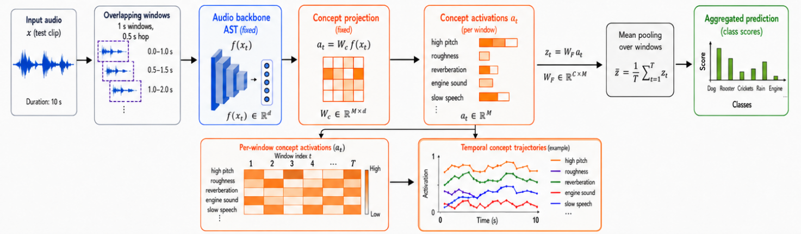
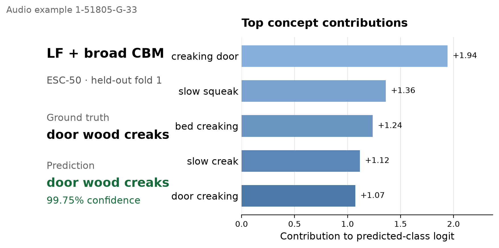
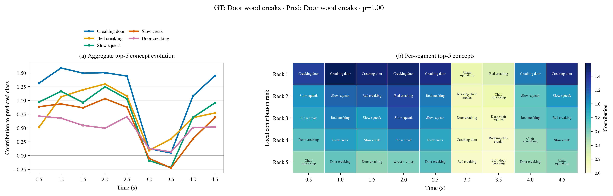

<h1 align="center">α-CBM: Label-Free Concept Bottleneck Models for Audio</h1>

<p align="center">
  <a href="https://adam-ousse.github.io/Label-free-CBM-Audio/"><strong>Interactive demo</strong></a>
  ·
  <a href="https://openreview.net/forum?id=92E7slVpxY&noteId=92E7slVpxY"><strong>OpenReview</strong></a>
  ·
  <a href="notebooks/DeepSeek_audio_concept_generation.ipynb"><strong>Generation notebook</strong></a>
</p>

<p align="center">
  <a href="https://openreview.net/profile?id=~Amine_Maazizi1"><em>Amine Maazizi</em></a> · <a href="https://openreview.net/profile?id=~Adam_Gassem1"><em>Adam Gassem</em></a>
</p>

## Abstract

<strong>α-CBM</strong> adapts Label-Free Concept Bottleneck Models (LF-CBMs) to audio classification. A fine-tuned Audio Spectrogram Transformer (AST) supplies audio features, CLAP grounds textual concepts in audio, and a sparse linear classifier maps concept activations to predictions. The result retains competitive classification performance while exposing audible, editable reasons for each decision.

<p align="center">
  
</p>
<p align="center"><em>Audio α-CBM architecture: DeepSeek proposes LF, broad, and contrastive candidates; CLAP and the audio data filter and ground them before sparse classification.</em></p>

## What this project adds

The initial audio concept vocabulary is the union

<p align="center"><strong>C<sub>0</sub> = C<sub>LF</sub> ∪ C<sub>broad</sub> ∪ C<sub>contrastive</sub>.</strong></p>

- **LF concepts** adapt the original class-conditioned LF-CBM prompts to audible characteristics, acoustic components, and broader sound categories.
- **Broad concepts** provide a dataset-independent perceptual vocabulary: pitch, spectral balance, tonality, timbre, texture, rhythm, attack/decay, reverberation, spatial impression, and production mechanism.
- **Contrastive concepts** describe general acoustic dimensions that distinguish LLM-discovered groups of confusable classes.
- **Temporal explanations** run the model over overlapping 1-second windows, exposing when each concept supports the prediction.
- **Concept interventions** let a user change the top-five concept signals and immediately inspect the exact last-layer counterfactual.

The LLM only proposes candidates. The existing LF-CBM filters, CLAP grounding on the training audio, concept bottleneck learning, and projectability filtering determine which concepts remain usable.

## Interactive demo

The [GitHub Pages explorer](https://adam-ousse.github.io/Label-free-CBM-Audio/) uses the ESC-50 **LF + broad** model. It contains correct and incorrect held-out examples, audio playback, top-five concept interventions, and segmented temporal explanations. Everything runs locally in the browser; no inference server is required.

<p align="center">
  <a href="https://adam-ousse.github.io/Label-free-CBM-Audio/assets/audio/1-24524-A-19.wav"><strong>Listen to the 5-second ESC-50 audio clip</strong></a>
</p>
<p align="center">
  
</p>
<p align="center"><em>The LF + broad CBM correctly predicts “thunderstorm” with 98.93% confidence from general acoustic evidence rather than concepts containing the class name.</em></p>

## Main results

Accuracy, macro-F1, and sparse-head zeros are percentages. All values use a fixed held-out split and seed. CREMA-D reports the latest speech-targeted concept protocol; ESC-50 and UrbanSound8K use the shared audio vocabulary.

| Dataset | Test protocol | Model | Accuracy | Macro-F1 | Sparsity |
| --- | --- | --- | ---: | ---: | ---: |
| ESC-50 | fold 1 | Fine-tuned AST | 93.50 | 93.28 | — |
| ESC-50 | fold 1 | LF + broad CBM | **93.50** | **93.39** | 92.58 |
| UrbanSound8K | fold 10 | Fine-tuned AST | 89.01 | 90.03 | — |
| UrbanSound8K | fold 10 | LF + broad CBM | **89.84** | **90.94** | 86.04 |
| CREMA-D | fixed test split | Fine-tuned AST | 70.05 | **52.76** | — |
| CREMA-D | fixed test split | Targeted full CBM | **70.25** | 51.58 | 92.79 |

The complete source ablation trains `lf`, `lf_broad`, `lf_contrastive`, and `full` with matched filtering and optimization settings. Its reports include accuracy, macro-F1, retained concepts, and sparse-head statistics.

## Temporal explanations

Segmented inference uses a 1.0-second window, 0.5-second hop, and mean/max/log-mean-exp pooling. CBM pooling operates on standardized temporal concepts before the sparse classifier; AST pooling operates on per-segment logits.

<p align="center">
  
</p>
<p align="center"><em>Example LF + broad explanation: concept contributions vary across overlapping audio windows while retaining a global class decision.</em></p>

## Reproduce the experiments

Run every command from the repository root. Python 3.10 or newer and a CUDA-capable PyTorch installation are recommended.

### 1. Install

```bash
git clone https://github.com/Adam-Ousse/Label-free-CBM-Audio.git
cd Label-free-CBM-Audio
python -m venv .venv
source .venv/bin/activate
python -m pip install --upgrade pip
python -m pip install -r requirements.txt
cp .env.example .env
```

Set these values in `.env` when regenerating concepts:

```dotenv
DEEPSEEK_API_KEY=your_key
DEEPSEEK_MODEL=deepseek-chat
```

The concept files already committed under `data/concept_sets/` can be used without a DeepSeek key.

### 2. Prepare the datasets

```bash
python data/download_esc50.py --output_dir data/esc50/raw
python data/prepare_esc50.py \
  --esc50_root data/esc50/raw/ESC-50-master \
  --out_root data/esc50 --repo_root .

python data/download_urbansound8k.py --output_dir data/urbansound8k/raw
python data/prepare_urbansound8k.py \
  --urbansound8k_root data/urbansound8k/raw \
  --out_root data/urbansound8k --repo_root .

python data/download_cremad.py --output_dir data/cremad/raw
python data/prepare_cremad.py \
  --cremad_root data/cremad/raw \
  --out_root data/cremad --repo_root . \
  --val_fraction 0.1 --split_seed 42
```

The reported fine-tuned AST checkpoints are downloaded automatically from Hugging Face:

- `Adam-ousse/ast-esc50-finetuned-fold1`
- `Adam-ousse/ast-urbansound8k-finetuned-fold10`
- `Adam-ousse/ast-cremad-finetuned`

### 3. Generate and filter ESC-50/UrbanSound8K concepts

To regenerate all three candidate sources with DeepSeek:

```bash
python -m scripts.concepts.generate_deepseek_concept_sets \
  --datasets esc50 urbansound8k \
  --mode all --stage generate

python -m scripts.concepts.generate_deepseek_concept_sets \
  --datasets esc50 urbansound8k \
  --mode all --stage process --device cuda
```

Build the four matched ablation inputs. This step can also be run directly with the checked-in source concepts:

```bash
python -m scripts.concepts.prepare_cbm_ablation_concepts \
  --datasets esc50 urbansound8k --device cuda
```

The backward-compatible command `python generate_deepseek_concept_sets.py ...` remains available. The notebook [`DeepSeek_audio_concept_generation.ipynb`](notebooks/DeepSeek_audio_concept_generation.ipynb) walks through the generation stages interactively.

### 4. Evaluate AST baselines

```bash
python -m scripts.evaluation.evaluate_ast_baselines \
  --datasets esc50 urbansound8k cremad --device cuda
```

Outputs are written to `results/audio_concept_ablation/baselines/`.

### 5. Train the environmental-audio CBM ablations

```bash
python -m scripts.training.run_audio_concept_ablation \
  --datasets esc50 urbansound8k \
  --variants lf lf_broad lf_contrastive full \
  --device cuda
```

The reported defaults are seed 42, 1,000 projection steps, cosine-cubed similarity, activation cutoff 0.25, projectability cutoff 0.45, 1,000 SAGA iterations, `lambda=0.0007`, and elastic-net mixing 0.99. Cached AST and CLAP activations are reused between variants.

### 6. Reproduce the targeted CREMA-D result

The CREMA-D rerun is isolated from the original concepts and results so it cannot overwrite them.

```bash
python -m scripts.concepts.generate_cremad_targeted_concepts \
  --output-root results/cremad_targeted_rerun_20260828/generation \
  --device cuda

python -m scripts.training.run_cremad_targeted_rerun \
  --experiment-root results/cremad_targeted_rerun_20260828 \
  --device cuda

python -m scripts.training.run_cremad_targeted_source_ablation \
  --experiment-root results/cremad_targeted_rerun_20260828 \
  --interpretability-cutoff 0.40 --lam 0.0015 \
  --device cuda
```

The first training command selects hyperparameters using validation macro-F1 with the test split hidden. The source ablation then freezes the selected projectability cutoff and sparse-head regularization across LF, LF+broad, LF+contrastive, and full variants.

### 7. Run segmented inference

Package the 12 canonical checkpoints and verify their checksums:

```bash
python -m scripts.release.build_google_drive_bundle
python -m scripts.release.build_google_drive_bundle \
  --output release/google_drive_bundle --verify-only
```

Then evaluate every AST and CBM with the same temporal protocol:

```bash
python -m scripts.evaluation.run_segmented_audio_ablation \
  --datasets esc50 urbansound8k cremad \
  --artifact-bundle release/google_drive_bundle \
  --window-sec 1.0 --hop-sec 0.5 --device cuda
```

Results are saved under `results/audio_concept_ablation/segmented/`.

### 8. Rebuild the interactive site

```bash
python -m scripts.visualization.build_esc50_showcase_assets \
  --samples-per-class 2 --max-concepts 5
python -m scripts.visualization.build_readme_prediction_figure
python -m http.server 8000
```

Open `http://localhost:8000/docs/`. Publishing instructions are in [`docs/README.md`](docs/README.md).

## Output map

| Output | Contents |
| --- | --- |
| `data/concept_sets/<dataset>/` | LF, broad, contrastive, union, provenance, and ablation concept files |
| `results/audio_concept_ablation/baselines/` | Fine-tuned AST metrics |
| `results/audio_concept_ablation/cbm/` | Environmental-audio CBM checkpoints and source-ablation reports |
| `results/cremad_targeted_rerun_20260828/` | Targeted CREMA-D generation, tuning, checkpoints, and metrics |
| `results/audio_concept_ablation/segmented/` | Segment caches, pooled metrics, predictions, and temporal concepts |
| `release/google_drive_bundle/` | Checksummed canonical checkpoint bundle; intentionally ignored by Git |

Dataset audio, local manifests, model caches, activations, and experiment outputs are excluded from Git.

## Repository structure

| Path | Purpose |
| --- | --- |
| `data/` | Dataset preparation and versioned concept sets |
| `models/` | AST backbone and classifier adapters |
| `scripts/concepts/` | DeepSeek generation and candidate-set preparation |
| `scripts/training/` | AST/CBM training and source ablations |
| `scripts/evaluation/` | Baseline, CBM, and segmented evaluation |
| `scripts/visualization/` | Plot and static-site asset generation |
| `scripts/release/` | Artifact packaging and checksum verification |
| `experiments/` | Hyperparameter and filtering studies |
| `notebooks/` | Reproducible generation and evaluation notebooks |
| `docs/` | Static GitHub Pages explorer |

## Citation and links

- [Project page and interactive demo](https://adam-ousse.github.io/Label-free-CBM-Audio/)
- [Paper on OpenReview](https://openreview.net/forum?id=92E7slVpxY&noteId=92E7slVpxY)
- [Original LF-CBM paper](https://arxiv.org/abs/2304.06129)

```bibtex
@misc{maazizi_alpha_cbm,
  title={{$\alpha$-CBM}: Label-Free Concept Bottleneck Models for Audio},
  author={Maazizi, Amine and Gassem, Adam},
  howpublished={OpenReview},
  url={https://openreview.net/forum?id=92E7slVpxY}
}
```

This work builds on:

```bibtex
@misc{oikarinen2023labelfreeconceptbottleneckmodels,
  title={Label-Free Concept Bottleneck Models},
  author={Tuomas Oikarinen and Subhro Das and Lam M. Nguyen and Tsui-Wei Weng},
  year={2023},
  eprint={2304.06129},
  archivePrefix={arXiv},
  primaryClass={cs.LG},
  url={https://arxiv.org/abs/2304.06129}
}
```
